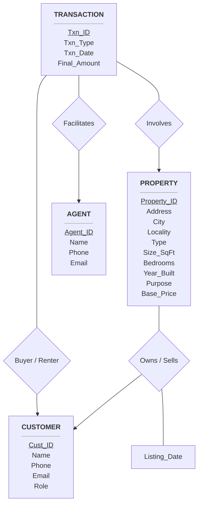

# CS241 Project: Deliverable 1 - Conceptual E-R Design

## 1. Assumptions

- Buyers, sellers, renters, and landlords are grouped into a single `Customer` entity with a `Role` attribute. 
- To calculate the "average time the property was on the market" a `Listing_Date` is required for properties and a `Txn_Date` is required for sales/rentals. 
- To handle an agent selling or renting multiple properties over time a `Transaction` entity is used.
- A property is either listed for 'Sale' or 'Rent'. Price representS the asking price or asking rent.
- If a person wants to both own/sell property and rent/buy property they have to register twice.
- Each Customer and Agent provides exactly one phone number and one email address.
- A property is strictly categorized as being for either 'Sale' or 'Rent'. 
- Base_Price attribute represents the total asking price for sales or the monthly asking rent for rental listings.
- Year_Built attribute is stored as a four-digit integer
- Address is decomposed into Locality and City. We assume "Guwahati" as the default city unless otherwise specified.

## 2. Entities and Attributes

* **Agent**
    * `Agent_ID` **(PK)**
    * `Name`
    * `Phone`
    * `Email`
* **Property**
    * `Property_ID` **(PK)**
    * `Address`
    * `City` (e.g. Guwahati)
    * `Locality` (e.g. G.S. Road)
    * `Type` (House/Apartment)
    * `Size_Sqft`
    * `Bedrooms`
    * `Year_Built`
    * `Purpose` (Sale/Rent)
    * `Base_Price` (Expected selling price or rent amount)
* **Customer**
    * `Cust_ID` **(PK)**
    * `Name`
    * `Phone`
    * `Email`
    * `Role` (Buyer/Seller/Renter/Owner)
* **Transaction**
    * `Txn_ID` **(PK)**
    * `Txn_Type` (Sale/Rent)
    * `Txn_Date`
    * `Final_Amount` (Actual sold price or final rent amount)

## 3. Relationships & Cardinalities

| Relationship Name | Entity 1 | Entity 2 | Cardinality | Description |
| :--- | :--- | :--- | :--- | :--- |
| **Owns / Sells** | Customer | Property | 1 : N | One customer (Owner/Seller) can list multiple properties for rent/sale but a property is listed by one customer. |
| **Facilitates** | Agent | Transaction | 1 : N | One agent can do many transactions but a single transaction is done by one agent. |
| **Involves** | Property | Transaction | 1 : N | A property can be sold/rented multiple times. |
| **Buys / Rents** | Customer | Transaction | 1 : N | A customer (Buyer/Renter) can participate in multiple transactions but a single transaction can only be done by one customer. |

## 4. E-R Diagram

