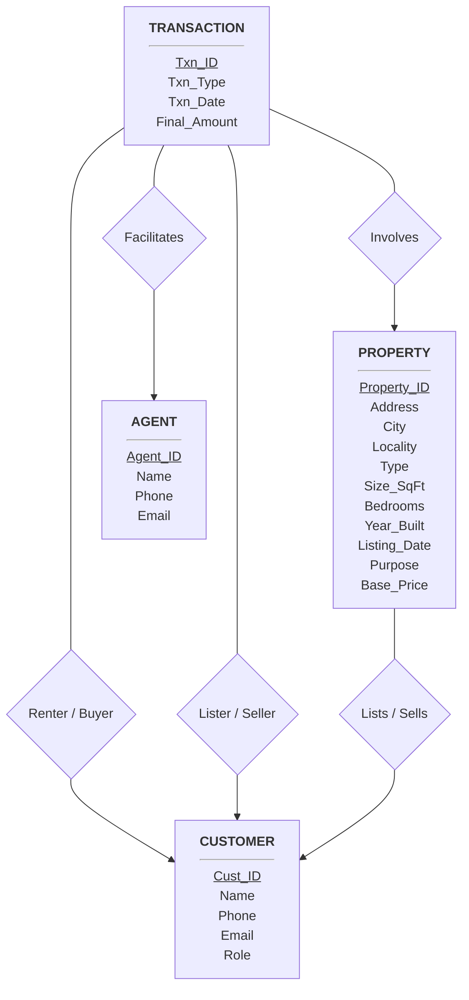

# CS241 Project: Deliverable 1 - Conceptual E-R Design

## 1. Assumptions

- **Person:** Buyers, sellers, renters, and landlords are grouped into a single `Person` entity with a "Role" attribute. 
- **Time on Market Calculation:** To calculate the "average time the property was on the market" a `Listing_Date` is required for properties and a `Transaction_Date` is required for sales/rentals. 
- **Transaction:** To handle an agent selling or renting multiple properties over time a `Transaction` entity is used.
- **Property States:** A property is either listed for 'Sale' or 'Rent'. Price representS the asking price or asking rent.

## 2. Entities and Attributes

* **Agent**
    * `Agent_ID` **(PK)**
    * `Name`
    * `Phone`
    * `Email`
* **Property**
    * `Property_ID` **(PK)**
    * `Address`
    * `City` (e.g. Guwahati)
    * `Locality` (e.g. G.S. Road)
    * `Type` (House/Apartment)
    * `Size_SqFt`
    * `Bedrooms`
    * `Year_Built`
    * `Listing_Date`
    * `Purpose` (Sale/Rent)
    * `Base_Price` (Expected selling price or rent amount)
* **Person**
    * `Person_ID` **(PK)**
    * `Name`
    * `Phone`
    * `Role` (Buyer/Seller/Renter/Owner)
* **Transaction**
    * `Transaction_ID` **(PK)**
    * `Transaction_Type` (Sale/Rent)
    * `Transaction_Date`
    * `Final_Amount` (Actual sold price or final rent amount)

## 3. Relationships & Cardinalities

| Relationship Name | Entity 1 | Entity 2 | Cardinality | Description |
| :--- | :--- | :--- | :--- | :--- |
| **Owns / Lists** | Person | Property | 1 : N | One person (Owner/Seller) can list multiple properties but a property is listed by one person. |
| **Facilitates** | Agent | Transaction | 1 : N | One agent can do many transactions but a single transaction is done by one agent. |
| **Involves** | Property | Transaction | 1 : N | A property can be sold/rented multiple times. |
| **Participates** | Person | Transaction | 1 : N | A person (Buyer/Renter) can participate in multiple transactions. |

## 4. E-R Diagram (Mermaid)

